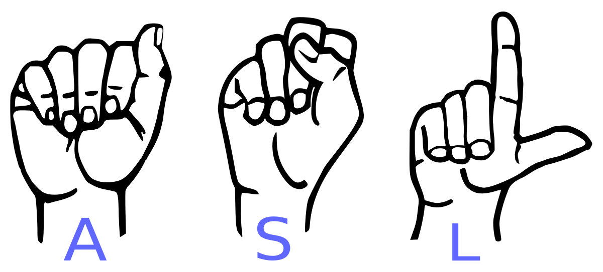

# A Helping Hand: American Sign Language Interpretor

# Table of Contents

- [Background](#background)
- [References](#references)
- [Data](#data)
- [Methods and Models](#methods-and-models)
  + [Model 1](#model-1)

## Background:

Modern American Sign Language (ASL) is a visual language that was developed in 1817 and is used as a visual means of communicating ideas and concepts. It is estimated by the National Center for Health Statistics that there are 28 million Americans living with some degree of hearing loss. Of the 28 million, there is an estimated 2 million Americans who are classified as deaf meaning they are unable to hear everyday sounds/speech even with hearing aids. 10% of the 2 million Americans were born deaf with the remaining 90% developing it later in life. (1) 

 

## Data:

The data I used to train my model consisted of 84,028 total images. I used 28 of the 29 classes from the [original dataset](https://www.kaggle.com/grassknoted/asl-alphabet) meaning I used classes A-Z in addition to the hand gesture indicating a space and images with no hand in the image. I reserved a total of 2,100 images per class for training, 900 images per class for validation and 1 image per class for testing. The images in the dataset featured varied lighting conditions as well as varied distances from the camera (see Figure 1). Because of the variation in lighting and distance, there was very little processing to do on the images. The only image processing used was sobel filtering for edge detection (see Figure 2). 

###### Figure 1:

###### Figure 2:

## Methods and Models:

I iterated through 3 versions of my baseline model:

* Model version 1 had a "simple" CNN architecture model
* Model version 2 used transfer learning
* Model version 3 had a "complex" CNN architecture model

Each model was trained twice: once on sobel y-axis filtering and once on sobel x-axis filtering.

### Model 1

This model had 2 main layers that started with convolution. I included additional layers in the mix such as Max pooling, drop out layers in which I gradually increased it from 0.25 to 0.5, batch normalization, as well as 2 dense layers. The last dense layer had 28 neurons for my 28 classes. This particular model had 277,180 total parameters of which 270,716 were trainable.

#### Sobel y:

* Accuracy: 93.8%
* loss: 21.89%

###### Figure 3:

#### Sobel x:

* Accuracy: 97.44%
* loss: 12.66%

###### Figure 4:

## References:

* (1) American Sign Language [website] https://www.startasl.com/american-sign-language/

